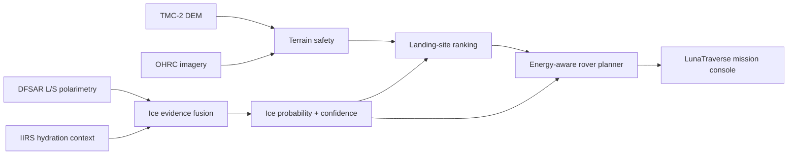

# LunaTraverse — Lunar Ice & Rover Traverse Planner

An end-to-end lunar mission-planning platform for characterizing possible subsurface ice in the Moon's south-polar region, ranking landing sites and generating hazard-aware rover traverses.

Built for Problem Statement 8 of the **Bharatiya Antariksh Hackathon 2026**:

> **Detection and Characterization of Subsurface Ice in Lunar South Polar Regions Using Chandrayaan-2 Radar and Imagery Data for Landing-Site and Rover-Traverse Planning**

## What is implemented

- Interactive Next.js lunar mission console
- Deterministic 48 × 48 south-polar demonstration scene at 30 m grid resolution
- Cratered elevation, slope, roughness, illumination, permanent-shadow and temperature layers
- Chandrayaan-2 DFSAR-inspired L/S-band CPR and DOP evidence
- IIRS-inspired hydration context and explicit roughness false-positive risk
- Explainable ice probability and confidence fusion
- Operational landing-site shortlist with safety and science scores
- Energy-aware A* rover traverse planning
- Distance, duration, energy, slope, shadow, hazard and science diagnostics
- FastAPI service with typed request contracts and OpenAPI explorer
- Python and deterministic frontend-engine test suites
- Docker Compose and GitHub Actions quality gates
- Architecture, methodology, data integration, API and model-card documentation

## Product workflow



## Mission workspaces

| Workspace | Capability |
| --- | --- |
| Ice probability | Multi-sensor evidence and confidence surface |
| Terrain safety | Slope and roughness constraints |
| Illumination | Permanent-shadow and operational-light context |
| Radar evidence | L/S-band CPR and DOP response |
| Traverse risk | Combined mobility and communication exposure |
| Landing sites | Safe, spaced, ranked landing candidates |
| Mission plan | Rover path, energy margin, hazards and science value |
| Evidence trace | Pixel-level radar, thermal and confidence explanation |

## Quick start

### Docker

```bash
cp .env.example .env
docker compose up --build
```

Open:

- Web application: `http://localhost:3000`
- API explorer: `http://localhost:8000/docs`

### Local development

```bash
python -m venv .venv
source .venv/bin/activate
python -m pip install -e ".[dev]"
npm install
```

Run the API:

```bash
make api
```

Run the web application in another terminal:

```bash
make web
```

## API examples

Rank landing sites:

```bash
curl -X POST http://localhost:8000/v1/landing-sites/rank \
  -H "Content-Type: application/json" \
  -d '{"seed":2026,"limit":6}'
```

Plan a rover traverse:

```bash
curl -X POST http://localhost:8000/v1/traverses/plan \
  -H "Content-Type: application/json" \
  -d '{"origin":{"row":18,"col":25},"battery_wh":2600,"risk_tolerance":0.45}'
```

Inspect one ice-evidence cell:

```bash
curl -X POST http://localhost:8000/v1/ice/query \
  -H "Content-Type: application/json" \
  -d '{"row":31,"col":34,"seed":2026}'
```

## Scientific strategy

The fusion model combines L-band CPR, S-band CPR, DOP, L/S contrast, cold-trap temperature, permanent shadow and hydration context. It does not treat high CPR alone as ice: roughness and low-coherence signatures are modeled as explicit false-positive risk.

The landing-site ranker first enforces hard safety constraints, then balances operational illumination and communications with distance to high-confidence science targets. The traverse planner excludes severe terrain and minimizes a cost that includes distance, slope, roughness, darkness, communications exposure and configurable risk tolerance.

## Demonstration data

```bash
make demo
```

The fixed seed creates a synthetic lunar south-polar analogue with known deposits and radar confounders. It enables complete end-to-end operation without redistributing Chandrayaan-2 products. It **does not represent a current or measured lunar ice map**.

For observed-data integration, use Chandrayaan-2 PDS4 products from ISRO's PRADAN archive and follow the data-use and acknowledgement terms described in `docs/data.md`.

## Validation

```bash
make test
```

Validated locally:

- 13 Python tests covering scene generation, evidence fusion, confounders, landing-site ranking, routing and API contracts
- 4 Node tests covering deterministic scene generation, polar evidence, site constraints and traverse energy
- Python bytecode compilation
- deterministic demonstration-data generation

Full CI additionally runs Python linting, frontend linting, TypeScript checking and the Next.js production build.

## Repository structure

```text
apps/web/                 Next.js lunar mission console
services/api/             FastAPI service and HTTP schemas
ml/lunar_planner/         Scene, evidence, landing and traverse engine
scripts/                  Demonstration-data generation
tests/                    Python and frontend-engine validation
docs/                     Architecture, methodology, data, API and model card
.github/workflows/        Continuous integration
```

## Responsible use

LunaTraverse is a planning and research prototype. Radar signatures are probabilistic evidence, landing sites are screening outputs and traverses are modeled plans. Operational use requires calibrated products, independent science review, high-resolution terrain validation, illumination and communications analysis, rover-specific engineering models and responsible human approval.

## License

MIT
