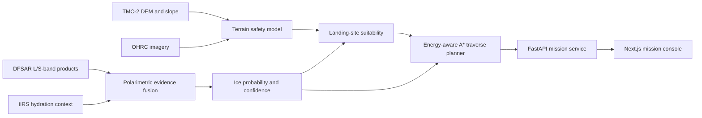

# System architecture

LunaTraverse separates scientific evidence fusion, surface operations analysis and product presentation so that every stage can be calibrated or replaced independently.

## Components

- `ml/lunar_planner/demo.py` creates a deterministic lunar south-polar analogue with craters, shadow, roughness, synthetic radar response and buried-ice deposits.
- `analysis.py` fuses L/S-band CPR, degree of polarization, temperature, hydration and permanent-shadow evidence while penalizing roughness-driven false positives.
- `landing.py` ranks safe landing cells using slope, roughness, illumination, communication visibility and proximity to science targets.
- `routing.py` runs an auditable A* planner over slope, surface roughness, darkness, communication exposure, energy and science utility.
- `services/api` exposes scene, ice-query, landing-site and traverse contracts.
- `apps/web` provides a deterministic offline mission console and can be connected to immutable API snapshots in production.

## Deployment boundary

The bundled scene is designed for repeatable software validation, not scientific inference. A production deployment should ingest calibrated PDS4 products, preserve source product identifiers and processing versions, and require human review before landing or rover decisions.
